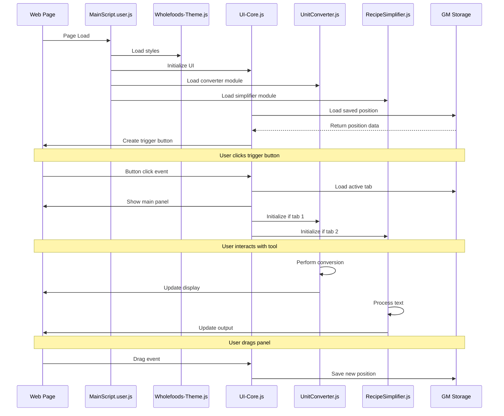
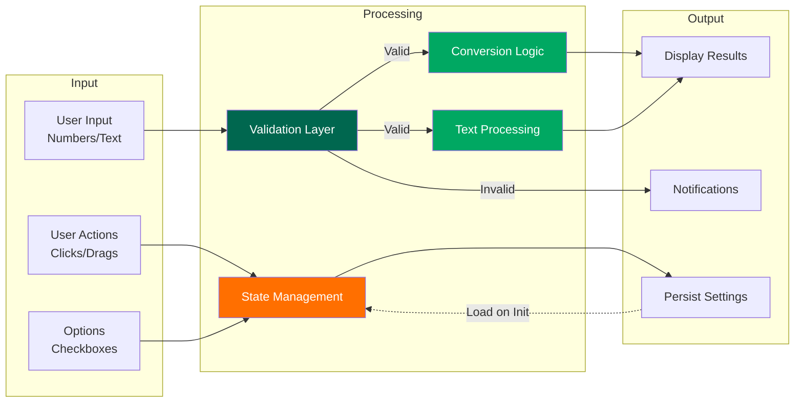
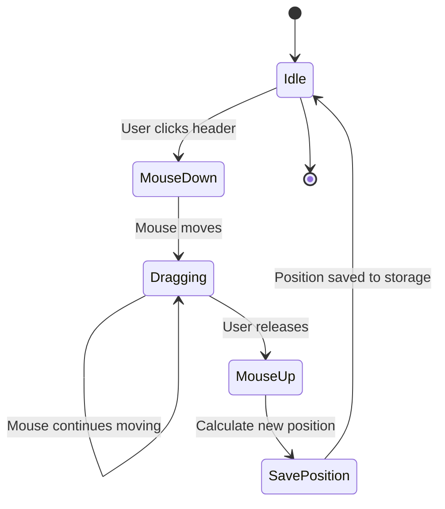
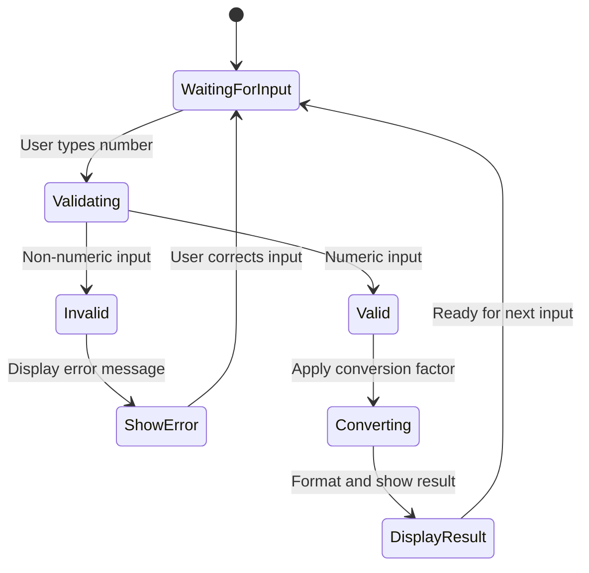
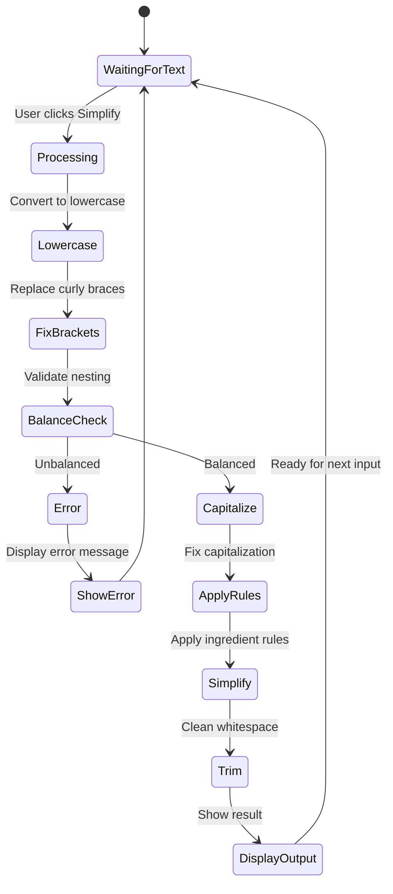

# Recipe Tools - Architecture & Implementation Plan

## System Architecture Diagram

```mermaid
graph TB
    subgraph "User Interface Layer"
        TB[Trigger Button<br/>Fixed Position]
        MP[Main Panel<br/>Draggable Container]
        TH[Tab Header<br/>Tool Selection]
        TC1[Unit Converter Tab<br/>Content Area]
        TC2[Recipe Simplifier Tab<br/>Content Area]
    end

    subgraph "Module Layer"
        MS[MainScript.user.js<br/>Orchestrator]
        UI[UI-Core.js<br/>Panel & Drag Logic]
        UC[UnitConverter.js<br/>Conversion Engine]
        RS[RecipeSimplifier.js<br/>Text Processing]
        ST[Wholefoods-Theme.js<br/>Styling Constants]
    end

    subgraph "Storage Layer"
        GM[GM_setValue/GM_getValue<br/>Tampermonkey Storage]
        LS[Local State<br/>Runtime Variables]
    end

    subgraph "External Services"
        GH[GitHub Repository<br/>Version Checking]
    end

    TB -->|Click| MP
    MP --> TH
    TH -->|Switch| TC1
    TH -->|Switch| TC2
    TC1 --> UC
    TC2 --> RS
    
    MS -->|@require| UI
    MS -->|@require| UC
    MS -->|@require| RS
    MS -->|@require| ST
    
    UI --> GM
    UC --> LS
    RS --> LS
    MS -->|Check Updates| GH
    
    ST -.->|Provides Styles| UI
    ST -.->|Provides Styles| UC
    ST -.->|Provides Styles| RS

    style MS fill:#00674F,color:#fff
    style UI fill:#00A862,color:#fff
    style UC fill:#00A862,color:#fff
    style RS fill:#00A862,color:#fff
    style ST fill:#FF6F00,color:#fff
```

## Module Dependency Flow



## Data Flow Architecture



## Implementation Phases

### Phase 1: Foundation (Core Infrastructure)
**Goal**: Establish the basic framework and module loading system

**Tasks**:
1. Create project directory structure
2. Set up MainScript.user.js with proper headers
3. Implement basic module loading pattern
4. Create Wholefoods-Theme.js with color constants
5. Test module loading in Tampermonkey

**Deliverables**:
- Working main script that loads successfully
- Theme constants accessible to all modules
- Console logging confirms module loading order

**Success Criteria**:
- No console errors on page load
- All modules load in correct order
- Theme variables are accessible

---

### Phase 2: UI Framework (Draggable Panel)
**Goal**: Build the core UI with draggable functionality

**Tasks**:
1. Create UI-Core.js module
2. Implement trigger button (fixed position)
3. Build main panel container with header
4. Add drag-and-drop functionality
5. Implement show/hide toggle
6. Add position persistence (GM_setValue/GM_getValue)
7. Create tab header structure
8. Implement tab switching logic

**Deliverables**:
- Functional trigger button
- Draggable main panel
- Working tab system (empty content areas)
- Position saves and restores on reload

**Success Criteria**:
- Panel can be dragged anywhere on screen
- Position persists across page reloads
- Tabs switch content areas correctly
- UI matches Whole Foods color scheme

---

### Phase 3: Unit Converter Tool
**Goal**: Implement fully functional unit conversion

**Tasks**:
1. Create UnitConverter.js module
2. Build conversion UI (inputs, dropdowns, button)
3. Implement conversion factor database
4. Create conversion calculation functions
5. Add real-time conversion (debounced)
6. Implement unit swap functionality
7. Add input validation
8. Create error handling and user feedback

**Deliverables**:
- Complete unit converter interface
- Working conversions for all unit types
- Real-time updates as user types
- Clear error messages for invalid inputs

**Success Criteria**:
- All conversions are mathematically accurate
- UI is responsive and intuitive
- Handles edge cases (zero, negative, very large numbers)
- Swap button works correctly

---

### Phase 4: Recipe Simplifier Tool
**Goal**: Implement text processing with VBA logic

**Tasks**:
1. Create RecipeSimplifier.js module
2. Build simplifier UI (input/output text areas, options)
3. Port VBA fixPara() function to JavaScript
4. Implement parentheses/bracket balancing
5. Add capitalization logic
6. Create ingredient simplification rules
7. Implement asterisk and GMO text removal
8. Add option toggles for each transformation
9. Create copy-to-clipboard functionality
10. Add validation and error messages

**Deliverables**:
- Complete recipe simplifier interface
- All VBA logic successfully ported
- Working option toggles
- Copy button functionality

**Success Criteria**:
- Text transformations match VBA behavior
- Parentheses/brackets balance correctly
- All simplification rules work as expected
- Options can be toggled independently
- Unbalanced brackets show clear error message

---

### Phase 5: Update System Integration
**Goal**: Add automatic version checking

**Tasks**:
1. Add update system code to MainScript.user.js
2. Implement version comparison logic
3. Create update notification modal
4. Add manual "Check for Updates" button to UI
5. Implement user action handlers (Update/Skip/Remind)
6. Add version check timestamp storage
7. Test with mock GitHub responses

**Deliverables**:
- Working automatic update checker
- Manual check button in UI
- Professional update notification modal
- Persistent user preferences

**Success Criteria**:
- Checks for updates on startup (after 5 seconds)
- Periodic checks every 24 hours
- Manual check works on demand
- User choices are respected and stored

---

### Phase 6: Polish & Testing
**Goal**: Refine UX and ensure quality

**Tasks**:
1. Add loading states and animations
2. Implement keyboard shortcuts
3. Add tooltips for all controls
4. Optimize performance (debouncing, lazy loading)
5. Cross-browser testing
6. Accessibility improvements (ARIA labels, focus management)
7. Mobile responsiveness (if applicable)
8. Code cleanup and documentation

**Deliverables**:
- Polished, professional UI
- Comprehensive inline code comments
- Performance optimizations applied
- Accessibility features implemented

**Success Criteria**:
- No console errors or warnings
- Smooth animations and transitions
- Keyboard navigation works throughout
- Passes basic accessibility checks

---

### Phase 7: Documentation & Deployment
**Goal**: Create user documentation and deploy

**Tasks**:
1. Write USER_GUIDE.md
2. Create installation instructions
3. Document all features with screenshots
4. Add troubleshooting section
5. Create GitHub repository
6. Set up proper file structure for @require URLs
7. Test installation from GitHub
8. Create release notes

**Deliverables**:
- Complete user guide
- GitHub repository with proper structure
- Installation instructions
- Release notes for v1.0.0

**Success Criteria**:
- Users can install from GitHub URLs
- Documentation is clear and comprehensive
- All features are documented with examples
- Update system works with GitHub URLs

---

## File Structure

```
Recipe_Simple/
├── MainScript.user.js              # Main orchestrator (5KB)
├── modules/
│   ├── UI-Core.js                  # UI framework (15KB)
│   ├── UnitConverter.js            # Conversion tool (10KB)
│   └── RecipeSimplifier.js         # Text processor (15KB)
├── styles/
│   └── Wholefoods-Theme.js         # Theme constants (5KB)
├── docs/
│   ├── TECHNICAL_SPECIFICATION.md  # This document
│   ├── ARCHITECTURE_PLAN.md        # Implementation plan
│   └── USER_GUIDE.md               # End-user documentation
├── tests/
│   ├── unit-converter.test.js      # Unit tests for converter
│   └── recipe-simplifier.test.js   # Unit tests for simplifier
├── examples/
│   ├── sample-recipes.txt          # Test data
│   └── conversion-examples.txt     # Test cases
├── README.md                        # Project overview
├── LICENSE                          # License file
└── .gitignore                       # Git ignore rules
```

## Module Interfaces

### UI-Core.js Public API

```javascript
// Exported functions (for testing)
module.exports = {
    createTriggerButton,
    createMainPanel,
    makeDraggable,
    showPanel,
    hidePanel,
    switchTab,
    saveUIState,
    loadUIState
};
```

### UnitConverter.js Public API

```javascript
module.exports = {
    initConverter,
    convert,
    swapUnits,
    getConversionFactor,
    validateInput,
    formatOutput
};
```

### RecipeSimplifier.js Public API

```javascript
module.exports = {
    initSimplifier,
    simplifyText,
    fixParentheses,
    removeAsterisks,
    simplifyIngredients,
    validateBrackets,
    copyToClipboard
};
```

### Wholefoods-Theme.js Public API

```javascript
window.WholeFoodsTheme = {
    colors: {
        primaryGreen: '#00674F',
        secondaryGreen: '#00A862',
        accentOrange: '#FF6F00',
        // ... more colors
    },
    styles: {
        button: { /* CSS properties */ },
        panel: { /* CSS properties */ },
        input: { /* CSS properties */ },
        // ... more style objects
    },
    applyStyles: function(element, styleKey) { /* ... */ }
};
```

## State Management Schema

```javascript
// Stored in GM_setValue/GM_getValue
const STATE_SCHEMA = {
    // UI State
    recipeTools_uiPosition: {
        top: '100px',
        left: '100px'
    },
    recipeTools_uiVisible: true,
    recipeTools_activeTab: 'converter', // 'converter' | 'simplifier'
    
    // Tool Settings
    recipeTools_simplifierOptions: {
        removeWater: true,
        simplifySalt: true,
        removeOrganic: false,
        removeGMO: true,
        fixCapitalization: true
    },
    
    // Update System
    recipeTools_lastVersionCheck: 1698765432000, // timestamp
    recipeTools_skippedVersion: '1.0.5',
    
    // User Preferences
    recipeTools_converterDefaults: {
        fromUnit: 'cup',
        toUnit: 'ml'
    }
};
```

## Event Flow Diagrams

### Drag and Drop Flow



### Unit Conversion Flow



### Recipe Simplification Flow



## Performance Optimization Strategy

### Debouncing Strategy
```javascript
// Real-time conversion with debouncing
let conversionTimeout;
function handleInputChange(value) {
    clearTimeout(conversionTimeout);
    conversionTimeout = setTimeout(() => {
        performConversion(value);
    }, 300); // 300ms delay
}
```

### Lazy Loading Strategy
```javascript
// Load tool modules only when tabs are activated
let converterLoaded = false;
let simplifierLoaded = false;

function switchToConverterTab() {
    if (!converterLoaded) {
        initializeConverter();
        converterLoaded = true;
    }
    showConverterContent();
}
```

### Memory Management
```javascript
// Clean up event listeners when hiding UI
function hidePanel() {
    // Remove event listeners
    eventListeners.forEach(({ element, event, handler }) => {
        element.removeEventListener(event, handler);
    });
    eventListeners = [];
    
    // Hide panel
    panel.style.display = 'none';
}
```

## Error Handling Strategy

### Validation Errors
- **User Input**: Show inline error messages
- **Conversion Errors**: Display helpful hints
- **Text Processing Errors**: Highlight problematic areas

### Network Errors
- **Update Check Fails**: Silent failure, retry later
- **Manual Check Fails**: Show user-friendly error message

### Storage Errors
- **GM_setValue Fails**: Fall back to sessionStorage
- **Load Fails**: Use default values

## Testing Strategy

### Unit Tests
```javascript
// Example test for conversion accuracy
describe('UnitConverter', () => {
    test('converts cups to milliliters correctly', () => {
        const result = convert(1, 'cup', 'ml');
        expect(result).toBeCloseTo(236.588, 2);
    });
    
    test('handles zero correctly', () => {
        const result = convert(0, 'cup', 'ml');
        expect(result).toBe(0);
    });
});
```

### Integration Tests
```javascript
// Example test for tab switching
describe('UI Tab Switching', () => {
    test('switches to converter tab', () => {
        switchTab('converter');
        expect(getActiveTab()).toBe('converter');
        expect(isConverterVisible()).toBe(true);
        expect(isSimplifierVisible()).toBe(false);
    });
});
```

## Deployment Checklist

- [ ] All modules tested individually
- [ ] Integration testing complete
- [ ] Cross-browser testing done
- [ ] Documentation complete
- [ ] GitHub repository created
- [ ] Files uploaded to GitHub
- [ ] @require URLs updated in MainScript
- [ ] Version number finalized
- [ ] Update URLs configured
- [ ] Installation tested from GitHub
- [ ] README.md updated
- [ ] Release notes created
- [ ] License file added

## Timeline Estimate

| Phase | Estimated Time | Dependencies |
|-------|---------------|--------------|
| Phase 1: Foundation | 2-3 hours | None |
| Phase 2: UI Framework | 4-6 hours | Phase 1 |
| Phase 3: Unit Converter | 3-4 hours | Phase 2 |
| Phase 4: Recipe Simplifier | 4-5 hours | Phase 2 |
| Phase 5: Update System | 2-3 hours | Phase 1 |
| Phase 6: Polish & Testing | 3-4 hours | All previous |
| Phase 7: Documentation | 2-3 hours | All previous |
| **Total** | **20-28 hours** | |

## Risk Assessment

| Risk | Probability | Impact | Mitigation |
|------|------------|--------|------------|
| VBA logic translation errors | Medium | High | Thorough testing with sample data |
| Browser compatibility issues | Low | Medium | Test in multiple browsers early |
| Performance issues with large text | Low | Medium | Implement debouncing and limits |
| GitHub hosting issues | Low | Low | Have backup CDN option |
| User confusion with UI | Medium | Medium | Clear tooltips and documentation |

## Success Metrics

- **Functionality**: All features work as specified
- **Performance**: UI responds within 100ms
- **Reliability**: No console errors during normal use
- **Usability**: Users can complete tasks without documentation
- **Maintainability**: Code is well-documented and modular
- **Compatibility**: Works in Chrome, Firefox, Edge with Tampermonkey

## Next Steps

1. **Review this plan** with stakeholders
2. **Set up development environment** (GitHub repo, local testing)
3. **Begin Phase 1** implementation
4. **Iterate** through phases sequentially
5. **Test continuously** throughout development
6. **Deploy** when all phases complete

---

*This architecture plan provides a comprehensive roadmap for implementing the Recipe Tools Tampermonkey script. Follow the phases sequentially for best results.*